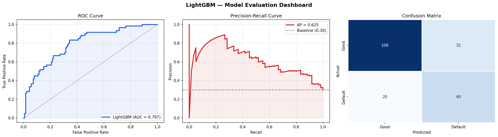
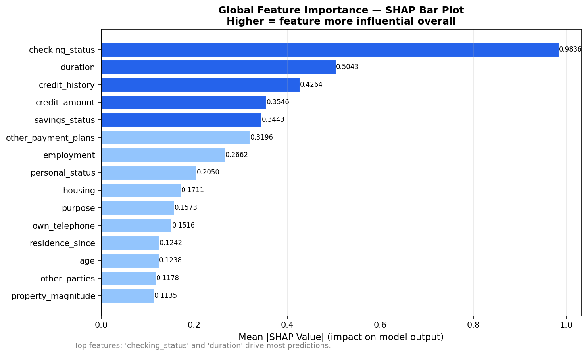
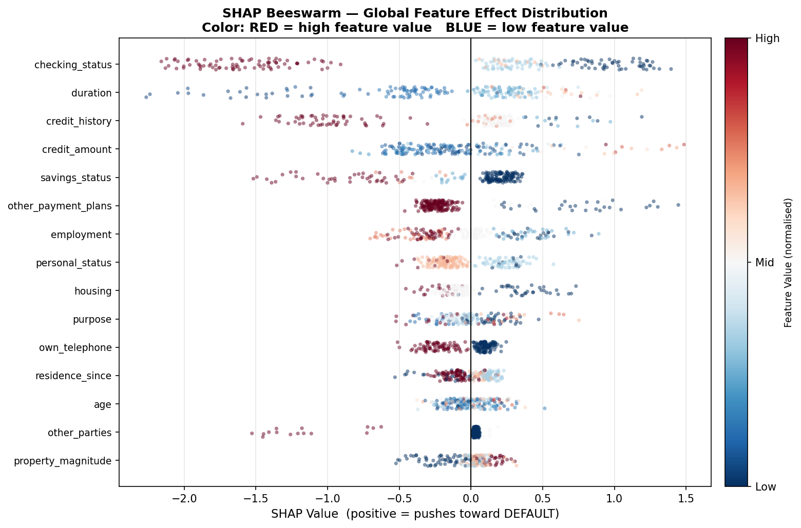
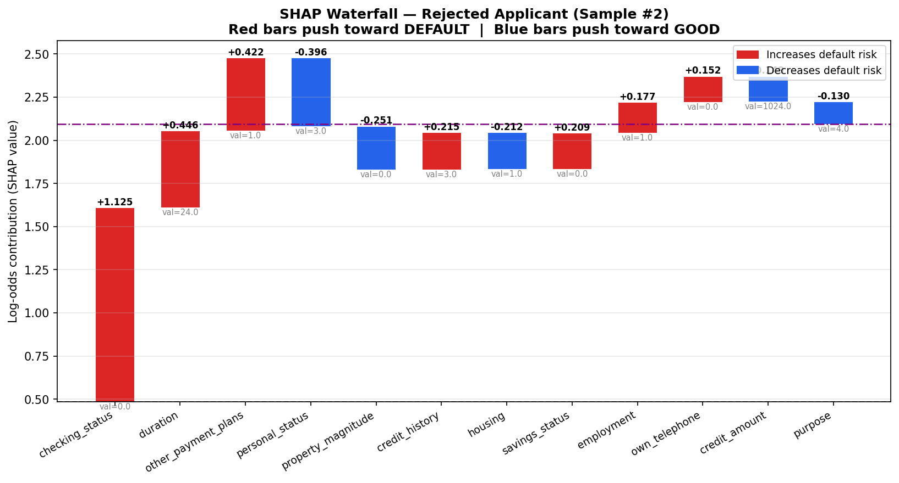
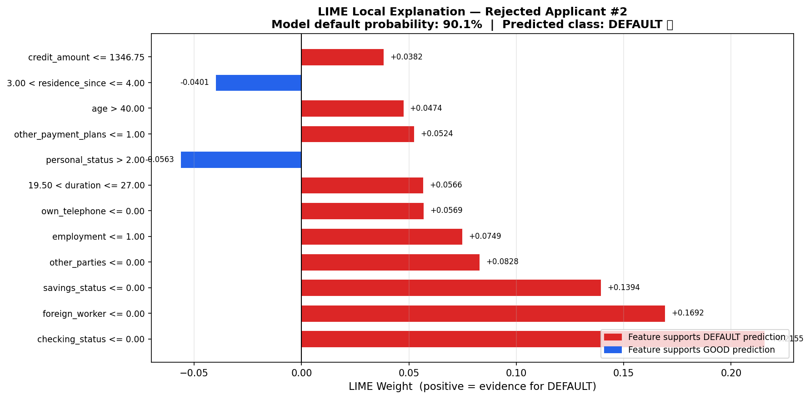
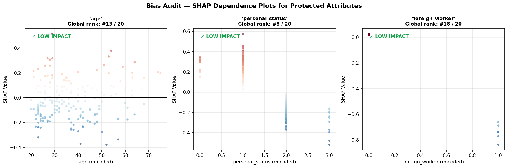

# 🏦 Trustworthy Credit Scoring with LightGBM, SHAP & LIME

> An end-to-end **Explainable AI (XAI)** pipeline for credit risk assessment — combining a high-performance gradient-boosted classifier with rigorous fairness auditing and human-readable explanations.


---

## 📌 Project Overview

Credit scoring models are high-stakes — a wrong prediction can deny someone a loan or expose a bank to default risk. This project builds a **trustworthy** scoring pipeline that is not only accurate but also **interpretable, auditable, and fair**.

| Component | Details |
|-----------|---------|
| **Dataset** | German Credit (UCI) — 1,000 applicants, 20 features |
| **Model** | LightGBM (leaf-wise GBDT) |
| **Imbalance fix** | SMOTE (k=5) + `scale_pos_weight` |
| **Global XAI** | SHAP TreeExplainer — Bar + Beeswarm + Waterfall |
| **Local XAI** | LIME — sparse linear surrogate, 5,000 perturbations |
| **Bias audit** | SHAP dependence plots for 3 protected attributes |

---

## 📊 Results at a Glance

| Metric | Score |
|--------|-------|
| ROC-AUC | **0.797** |
| Average Precision | **0.625** |
| F1 Score | **0.606** |

<p align="center">
  
</p>

---

## 🔍 Explainability

### Global Feature Importance (SHAP Bar)
`checking_status` and `duration` are the dominant drivers across all predictions.

<p align="center">
  
</p>

### Feature Effect Distribution (SHAP Beeswarm)
Each dot is one test sample. Low checking status (blue) strongly pushes toward DEFAULT.

<p align="center">
  
</p>

### Local Explanation — Rejected Applicant #2

**SHAP Waterfall** — why the model predicted DEFAULT at 90.1% probability:

<p align="center">
  
</p>

**LIME** — independent local surrogate confirms the same key drivers:

<p align="center">
  
</p>

---

## ⚖️ Bias Audit

SHAP dependence plots for three legally protected attributes confirm **LOW IMPACT** — none of `age`, `personal_status`, or `foreign_worker` drives the model's core decisions.

<p align="center">
  
</p>

---

## 🗂️ Repository Structure

```
trustworthy-credit-scoring/
│
├── Trustworthy_Credit_Scoring_LightGBM_SHAP_LIME.ipynb   # Main notebook
│
├── figures/                     # All output visualisations
│   ├── 00_project_summary.png
│   ├── 01_evaluation_dashboard.png
│   ├── 02A_shap_global_bar.png
│   ├── 02B_shap_beeswarm.png
│   ├── 02C_shap_waterfall_rejected.png
│   ├── 03_lime_local_explanation.png
│   └── 04_bias_audit_shap.png
│
├── slides/
│   └── The_Glass_Box.pptx       # Presentation deck
│
├── requirements.txt
└── README.md
```

---

## 🚀 Quick Start

### 1. Clone the repo
```bash
git clone https://github.com/<your-username>/trustworthy-credit-scoring.git
cd trustworthy-credit-scoring
```

### 2. Install dependencies
```bash
pip install -r requirements.txt
```

### 3. Run the notebook
Open in **Google Colab** (recommended) or Jupyter:

[](https://colab.research.google.com/github/sourourha266/trustworthy-credit-scoring/blob/main/Trustworthy_Credit_Scoring_LightGBM_SHAP_LIME.ipynb)

> The notebook downloads the German Credit dataset automatically from the UCI repository — no manual download needed.

---

## 📦 Requirements

```
lightgbm>=3.3
shap>=0.41
lime>=0.2
imbalanced-learn>=0.10
scikit-learn>=1.2
pandas>=1.5
numpy>=1.23
matplotlib>=3.6
seaborn>=0.12
```

Install all at once:
```bash
pip install lightgbm shap lime imbalanced-learn scikit-learn pandas numpy matplotlib seaborn
```

---

## 🧠 Key Concepts

### Why LightGBM?
- **Leaf-wise growth** achieves better accuracy than level-wise (XGBoost default) on tabular data
- **Histogram-based binning** gives 10–20× speed improvement
- Native categorical feature support; no one-hot encoding needed
- `TreeExplainer` (SHAP) runs in O(T·L·D) — near-instant on LightGBM

### Why SHAP?
SHAP (SHapley Additive exPlanations) is the only XAI method satisfying all four axiomatic fairness properties simultaneously: **Efficiency, Symmetry, Dummy, and Consistency**. It provides both global (population-level) and local (per-prediction) explanations from the same framework.

### Why LIME?
LIME builds a **sparse linear surrogate** locally around each prediction by perturbing the input and fitting a weighted LASSO regression. It serves as an independent sanity-check against SHAP's tree-specific assumptions.

### Handling Class Imbalance
A two-pronged strategy prevents the model from ignoring the minority (Default) class:
1. **SMOTE** on training data only (no leakage) — balances to 1:1 ratio
2. **`scale_pos_weight`** — further penalises false negatives during training

---

## 📁 Dataset

**German Credit Dataset** — UCI Machine Learning Repository  
- 1,000 loan applicants, 20 mixed-type features  
- Target: `Good` (700) vs `Default` (300) — ~2.3:1 imbalance  
- Source: [UCI Repository](https://archive.ics.uci.edu/ml/datasets/statlog+(german+credit+data))

---

## 👩‍💻 Author

**Sourour Hammoud**  
M.Eng. Candidate — Computer & Communication Engineering / IoT & Smart Systems  
[Portfolio](https://sourourhammoud.netlify.app)

---

## 📄 License

This project is licensed under the MIT License — see [LICENSE](LICENSE) for details.
